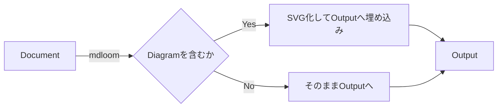
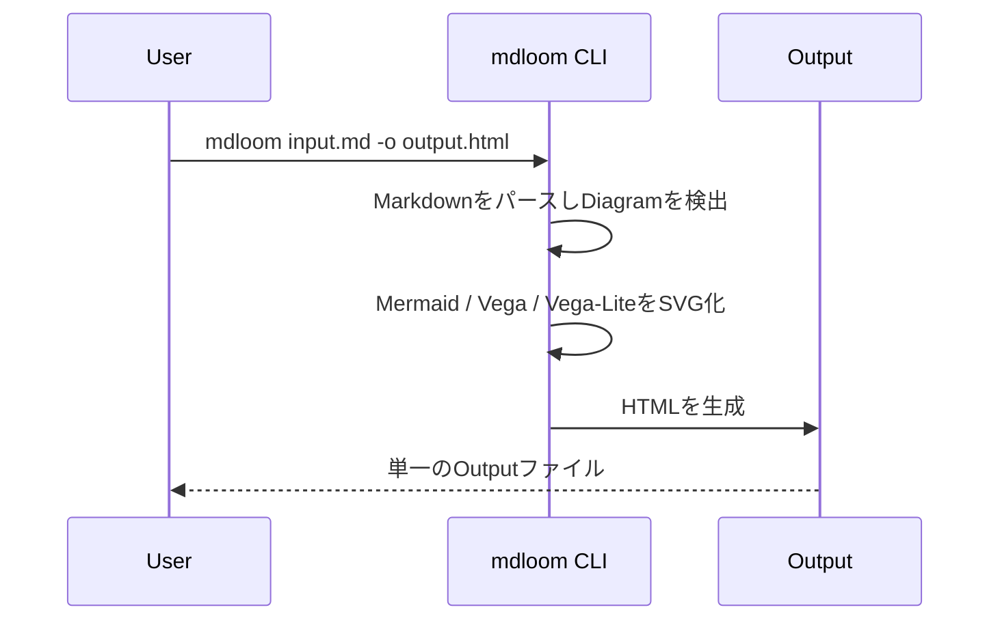

# mdloom サンプルDocument

このDocumentは、mdloomによるMarkdown記法からHTMLへの変換、およびMermaid記法・Vega/Vega-Lite仕様のDiagramがOutputへ正しく埋め込まれることを確認するためのサンプルです。

```sh
mdloom examples/example.md -o example.html
```

## GFM記法の確認

### テキスト装飾

**太字**、*斜体*、~~取り消し線~~、`インラインコード`、そして[リンク](https://github.com/backpaper0/mdloom)を含む一文です。

### リスト

順序なしリスト:

- Markdown記法からHTMLへの変換
- Mermaid記法によるDiagram
- Vega / Vega-Lite仕様によるDiagram

順序付きリスト:

1. Documentを用意する
2. `mdloom`コマンドで変換する
3. Outputをブラウザで開く

タスクリスト:

- [x] GFM記法のHTML変換を確認する
- [x] Mermaid記法のDiagramを確認する
- [ ] Vega / Vega-Lite仕様のDiagramを確認する

### 表

| 記法        | 内容                                   |
| ----------- | -------------------------------------- |
| Mermaid     | ` ```mermaid ` フェンスで記述するDiagram |
| Vega        | ` ```vega ` フェンスで記述するDiagram    |
| Vega-Lite   | ` ```vega-lite ` フェンスで記述するDiagram |

### 引用とコードブロック

> Diagramは変換時にSVG化され、OutputへDiagram Viewer付きで埋め込まれます。

```ts
export function greet(name: string): string {
  return `Hello, ${name}!`;
}
```

### 水平線

---

## Mermaid記法のDiagram

以下はフローチャートの例です。



以下はシーケンス図の例です。



## Vega-Lite仕様のDiagram

以下は棒グラフの例です。

```vega-lite
{
  "$schema": "https://vega.github.io/schema/vega-lite/v5.json",
  "description": "月別の売上を示す棒グラフ",
  "width": 400,
  "height": 200,
  "data": {
    "values": [
      { "month": "1月", "sales": 120 },
      { "month": "2月", "sales": 150 },
      { "month": "3月", "sales": 90 },
      { "month": "4月", "sales": 180 },
      { "month": "5月", "sales": 160 }
    ]
  },
  "mark": "bar",
  "encoding": {
    "x": { "field": "month", "type": "nominal", "title": "月" },
    "y": { "field": "sales", "type": "quantitative", "title": "売上" }
  }
}
```

## Vega仕様のDiagram

以下はVegaの生仕様による円グラフの例です。

```vega
{
  "$schema": "https://vega.github.io/schema/vega/v5.json",
  "width": 300,
  "height": 300,
  "autosize": "pad",
  "data": [
    {
      "name": "table",
      "values": [
        { "category": "Markdown", "value": 40 },
        { "category": "Mermaid", "value": 30 },
        { "category": "Vega / Vega-Lite", "value": 30 }
      ],
      "transform": [
        {
          "type": "pie",
          "field": "value"
        }
      ]
    }
  ],
  "scales": [
    {
      "name": "color",
      "type": "ordinal",
      "domain": { "data": "table", "field": "category" },
      "range": { "scheme": "pastel1" }
    }
  ],
  "marks": [
    {
      "type": "arc",
      "from": { "data": "table" },
      "encode": {
        "enter": {
          "x": { "signal": "width / 2" },
          "y": { "signal": "height / 2" },
          "startAngle": { "field": "startAngle" },
          "endAngle": { "field": "endAngle" },
          "innerRadius": { "value": 0 },
          "outerRadius": { "signal": "width / 2" },
          "fill": { "scale": "color", "field": "category" }
        }
      }
    }
  ]
}
```
